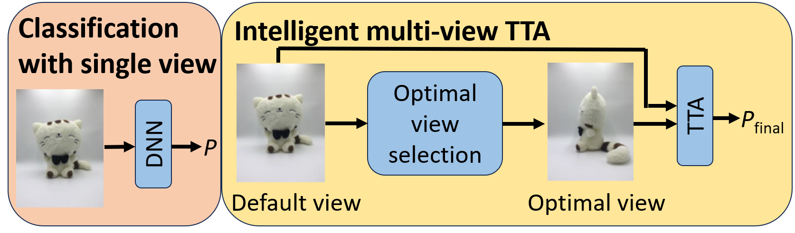
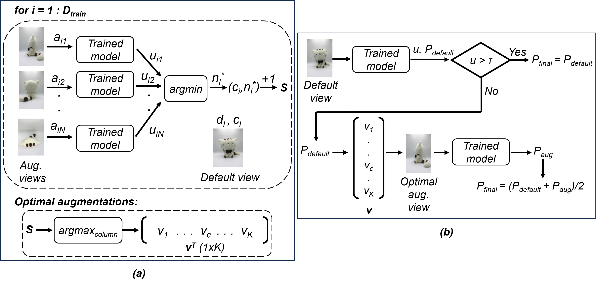

# Intelligent-Multi-View-Test-Time-Augmentation

Code for generating the results in Intelligent Multi-View Test Time Augmentation published at ICIP 2024.

Work conducted at OLIVES@GaTech. Arxiv paper available at ....

Official code repository for the paper: E. Ozturk, M. Prabhushankar, and G. AlRegib, "Intelligent Multi-View Test Time Augmentation," submitted to IEEE International Conference on Image Processing (ICIP), Feb. 11, 2024.

Comparison of Intelligent Multi-View TTA with the conventional single-view method. This illustrates how the intelligent approach dynamically selects augmentation views to refine predictions (P), in contrast to the conventional method’s reliance on a single, static view.

## Abstract

In this study, we introduce an intelligent Test Time Augmentation (TTA) algorithm designed to enhance the robustness and accuracy of image classification models against viewpoint variations. Unlike traditional TTA methods that indiscriminately apply augmentations, our approach intelligently selects optimal augmentations based on predictive uncertainty metrics. This selection is achieved via a two-stage process: the first stage identifies the optimal augmentation for each class by evaluating uncertainty levels, while the second stage implements an uncertainty threshold to determine when applying TTA would be advantageous. This methodological advancement ensures that augmentations contribute to classification more effectively than a uniform application across the dataset. Experimental validation across several datasets and neural network architectures validates our approach, yielding an average accuracy improvement of 1.73% over methods that use single-view images. This research underscores the potential of adaptive, uncertainty-aware TTA in improving the robustness of image classification in the presence of viewpoint variations, paving the way for further exploration into intelligent augmentation strategies.

The proposed algorithm. (a) Stage-1: optimal augmentation view selection. (b) Stage-2: uncertainty assessment.

## Usage

## Questions?

If you have any questions regarding the dataset or the code, you can contact the author (eozturk7@gatech.edu).
